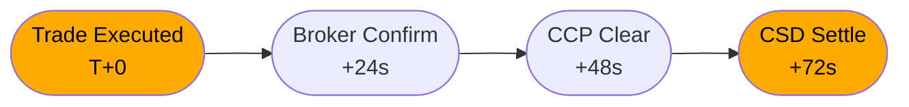
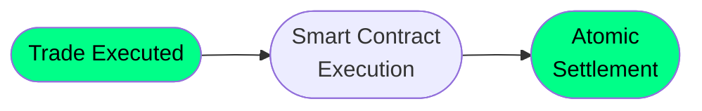
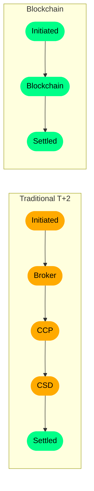

# Securities Settlement Simulator

<p align="center">
  
  
  
  
</p>

A **parallel universe** dashboard demonstrating the contrast between **Traditional T+2 securities settlement** and **Blockchain Real-Time settlement**. This simulator provides a visual, interactive way to understand how blockchain technology can transform post-trade settlement infrastructure.

---

## Table of Contents

1. [Overview](#overview)
2. [Problem Statement](#problem-statement)
3. [Solution Approach](#solution-approach)
4. [Tech Stack](#tech-stack)
5. [Architecture](#architecture)
6. [Getting Started](#getting-started)
7. [Running the Application](#running-the-application)
8. [Features](#features)
9. [API Endpoints](#api-endpoints)
10. [Project Structure](#project-structure)
11. [Trade Flow Visualization](#trade-flow-visualization)
12. [Settlement Paths Explained](#settlement-paths-explained)
13. [Future Enhancements](#future-enhancements)

---

## Overview

Securities settlement is the process of transferring ownership of securities from seller to buyer and cash from buyer to seller. The traditional financial industry operates on a **T+2** settlement cycle—trades executed on day (T) are settled two days later. This creates **counterparty risk** during the settlement window.

This simulator demonstrates:
- How **Traditional T+2 settlement** works through Broker → CCP → CSD
- How **Blockchain real-time settlement** eliminates counterparty risk
- Visual comparison of settlement times and risk exposure

---

## Problem Statement

### Traditional Settlement (T+2)



**Issues:**
- Multi-day settlement window creates counterparty risk
- Multiple intermediaries increase operational complexity
- Manual reconciliation required
- Settlement failures can cascade

### The Blockchain Alternative



**Benefits:**
- Atomic Delivery-vs-Payment (DvP)
- Real-time settlement
- No counterparty risk
- Immutable audit trail

---

## Solution Approach

This project implements a **side-by-side comparison**:

1. **Traditional Path**: Simulates T+2 settlement with realistic delays (24s per stage)
2. **Blockchain Path**: Simulates atomic settlement via smart contract
3. **Visual Dashboard**: Real-time visualization of trades flowing through each path
4. **Flow Diagram**: Interactive React Flow canvas showing trade progression

---

## Tech Stack

### Frontend

| Technology | Version | Purpose |
|------------|---------|---------|
| React | 18.3 | UI framework |
| Vite | 6.0 | Build tool |
| TailwindCSS | 3.4 | Styling |
| React Flow (@xyflow/react) | Latest | Flow visualization |
| Dagre | latest | Auto-layout algorithm |
| Lucide React | latest | Icons |

### Backend

| Technology | Version | Purpose |
|------------|---------|---------|
| Go | 1.22+ | Backend runtime |
| Gin | latest | HTTP web framework |
| Gorilla WebSocket | latest | Real-time updates |
| SQLite | - | Local database |

### Development

| Tool | Purpose |
|------|---------|
| Docker Compose | Container orchestration |
| Hardhat | Ethereum development environment |

---

## Architecture

```mermaid
flowchart TB
    subgraph Frontend["<b>FRONTEND</b><br/>React<br/>http://localhost:5173"]
        TC[Trade Cards]
        FP[Flow Panel<br/>React Flow]
        TT[Trade Table]
    end

    WS[WebSocket<br/>ws://localhost:8000/ws]

    subgraph Blockchain["<b>BLOCKCHAIN PATH</b><br/>Real-Time"]
        BC[Settlement Service<br/>Port 8000<br/><2s Settlement]
    end

    subgraph Traditional["<b>TRADITIONAL PATH (T+2)</b>"]
        BR[Broker<br/>Port 8001<br/>+24s]
        CP[CCP<br/>Port 8002<br/>+24s]
        CS[CSD<br/>Port 8003<br/>+24s]
    end

    DB[(SQLite<br/>settlement.db)]

    TC --> WS
    FP --> WS
    TT --> WS
    WS --> BC
    WS --> BR
    BR --> CP
    CP --> CS
    BC --> DB
    BR -.-> DB
    CP -.-> DB
    CS -.-> DB

    style TC fill:#1a1a2e,stroke:#ffaa00
    style FP fill:#1a1a2e,stroke:#00ff88
    style TT fill:#1a1a2e,stroke:#4488ff
    style BC fill:#0a2a1a,stroke:#00ff88
    style BR fill:#2a1a0a,stroke:#ffaa00
    style CP fill:#2a1a0a,stroke:#ffaa00
    style CS fill:#2a1a0a,stroke:#ffaa00
```



### Component Communication

1. **Frontend → Backend**: REST API for trade creation, wallet management
2. **Backend → Frontend**: WebSocket for real-time status updates
3. **T+2 Services**: Chain of microservice calls with simulated delays
4. **Blockchain**: Simulated smart contract execution

---

## Getting Started

### Prerequisites

| Requirement | Version | Installation |
|-------------|---------|--------------|
| Go | 1.22+ | [go.dev](https://go.dev/dl/) |
| Node.js | 18+ | [nodejs.org](https://nodejs.org/) |
| npm | 9+ | Comes with Node.js |

### Clone & Setup

```bash
git clone <repository-url>
cd blockchain-securities-settlement-simulator

# Install frontend dependencies
cd frontend
npm install

# Go back to root and install Go dependencies
cd ../backend
go mod tidy
```

---

## Running the Application

### Option 1: Manual (Recommended for Development)

Open **5 terminal windows**:

```bash
# Terminal 1: Settlement Service (Blockchain API + WebSocket server)
cd backend
go run ./cmd/settlement

# Terminal 2: Broker Service (T+2 Step 1)
cd backend
go run ./cmd/broker

# Terminal 3: CCP Service (T+2 Step 2)
cd backend
go run ./cmd/ccp

# Terminal 4: CSD Service (T+2 Step 3)
cd backend
go run ./cmd/csd

# Terminal 5: Frontend Development Server
cd frontend
npm run dev
```

Then open **http://localhost:3000** in your browser.

### Option 2: Using Docker Compose

```bash
docker-compose up
```

This starts all services in containers. Frontend available at http://localhost:3000.

---

## Features

### 1. Trade Execution Panel

- **Execute T+2**: Start a traditional trade through Broker → CCP → CSD
- **Execute Blockchain**: Start an atomic blockchain trade
- **Real-time timers**: Show time-at-risk for pending trades

### 2. Trade Flow Visualization (React Flow)

Interactive canvas showing:
- Stage nodes: Initiated → Broker/CCP/CSD → Settled
- Animated trade dots flowing through edges
- Color-coded paths (Amber = Traditional, Emerald = Blockchain)
- MiniMap for navigation

Toggle view with "Flow View" / "Table View" button.

### 3. Activity Log

- Real-time WebSocket updates
- Trade status changes
- Error notifications

### 4. Trade History Table

- Recent trades with status
- Path type badges
- Timestamps

### 5. Wallet Management

- Auto-created wallet on load
- Balance display (mock data)

---

## API Endpoints

### Settlement Service (Port 8000)

| Method | Endpoint | Description |
|--------|----------|-------------|
| POST | `/api/wallets` | Create wallet |
| GET | `/api/wallets/:address/balance` | Get balance |
| POST | `/api/trades` | Execute trade |
| GET | `/api/trades` | List trades |
| GET | `/api/trades/:id` | Get trade by ID |
| GET | `/api/ws` | WebSocket endpoint |
| GET | `/api/health` | Health check |

### Broker Service (Port 8001)

| Method | Endpoint | Description |
|--------|----------|-------------|
| POST | `/api/orders` | Submit order |

### CCP Service (Port 8002)

| Method | Endpoint | Description |
|--------|----------|-------------|
| POST | `/api/clearing` | Process clearing |

### CSD Service (Port 8003)

| Method | Endpoint | Description |
|--------|----------|-------------|
| POST | `/api/settlement` | Final settlement |

---

## Project Structure

```
blockchain-securities-settlement-simulator/
├── backend/                      # Go microservices
│   ├── cmd/
│   │   ├── settlement/           # Main API + WebSocket
│   │   ├── broker/               # T+2 Step 1
│   │   ├── ccp/                 # T+2 Step 2
│   │   └── csd/                 # T+2 Step 3
│   ├── internal/
│   │   ├── blockchain/          # Blockchain client
│   │   └── service/             # WebSocket hub
│   ├── pkg/shared/
│   │   ├── db/                  # Database utilities
│   │   └── models/               # Data models
│   ├── go.mod
│   ├── go.sum
│   └── settlement.db             # SQLite database
│
├── frontend/                     # React application
│   ├── src/
│   │   ├── components/
│   │   │   ├── TradeFlow.tsx    # React Flow canvas
│   │   │   ├── TradeNode.tsx   # Custom node component
│   │   │   └── TradeEdge.tsx   # Animated edge component
│   │   ├── hooks/
│   │   │   └── useTradeFlow.ts # Trade flow state + WebSocket
│   │   ├── App.tsx             # Main application
│   │   ├── App.css             # Styling
│   │   └── main.tsx            # Entry point
│   ├── package.json
│   ├── tailwind.config.js
│   ├── vite.config.ts
│   └── dist/                    # Build output
│
├── contracts/                    # Solidity smart contracts
│   └── (future)
│
├── docker-compose.yml            # Docker configuration
├── run.sh                        # Startup script
└── README.md                     # This file
```

---

## Trade Flow Visualization

### Overview

The Trade Flow panel is an **interactive React Flow canvas** that visualizes trades moving through settlement stages in real-time.

### Components

| Component | File | Purpose |
|-----------|------|---------|
| `TradeFlow` | `components/TradeFlow.tsx` | Main canvas with React Flow |
| `TradeNode` | `components/TradeNode.tsx` | Custom stage nodes |
| `TradeEdge` | `components/TradeEdge.tsx` | Animated edges |
| `useTradeFlow` | `hooks/useTradeFlow.ts` | State management + WebSocket |

### Visualization Features

- **Auto-layout**: Dagre algorithm positions nodes horizontally
- **Stage nodes**: Initiated, Broker, CCP, CSD, Blockchain, Settled
- **Animated dots**: Trades animate along edges when active
- **Color coding**: Amber (Traditional), Emerald (Blockchain)
- **Real-time updates**: WebSocket triggers re-render on status change
- **Max 10 trades**: Shows most recent trades including historical

### Layout Diagram



### How It Works

1. **Fetch Trades**: On mount, fetch recent trades from API
2. **WebSocket Subscription**: Listen for `status` and `settled` events
3. **Compute Layout**: Dagre calculates node positions
4. **Count by Stage**: Aggregate trades per stage
5. **Render**: React Flow displays nodes and animated edges

---

## Settlement Paths Explained

### Traditional T+2 Path

| Stage | Service | Delay | Description |
|-------|---------|-------|-------------|
| 1 | Broker | 24s | Order acceptance and validation |
| 2 | CCP | 24s | Clearing house nets positions |
| 3 | CSD | 24s | Central securities depository settles |

**Total Time**: ~72 seconds (simulated, real world = 2 days)
**Risk**: Counterparty risk increases with time ($20/second simulated)

### Blockchain Real-Time Path

| Stage | Description |
|-------|-------------|
| 1 | Smart contract receives trade parameters |
| 2 | Atomic DvP execution |
| 3 | Settlement recorded on-chain |

**Total Time**: < 2 seconds
**Risk**: Zero - atomic transaction guarantees

---

## Future Enhancements

### Planned Features

1. **Real Blockchain Integration**
   - Connect to Ethereum testnet (Sepolia)
   - Deploy actual Solidity smart contracts
   - Real wallet connections (MetaMask)

2. **Metrics Dashboard**
   - Settlement time comparison charts
   - Counterparty risk calculation
   - Success/failure rates

3. **Multi-trade Simulation**
   - Batch trade execution
   - Stress testing
   - Performance benchmarks

4. **Additional Settlement Models**
   - T+1 settlement
   - Same-day settlement
   - Continuous settlement

---

## License

MIT License

---

## Acknowledgments

- [React Flow](https://reactflow.dev/) - For the amazing visualization library
- [Gin](https://gin-gonic.com/) - Go web framework
- [TailwindCSS](https://tailwindcss.com/) - Styling
- [Lucide](https://lucide.dev/) - Icons
